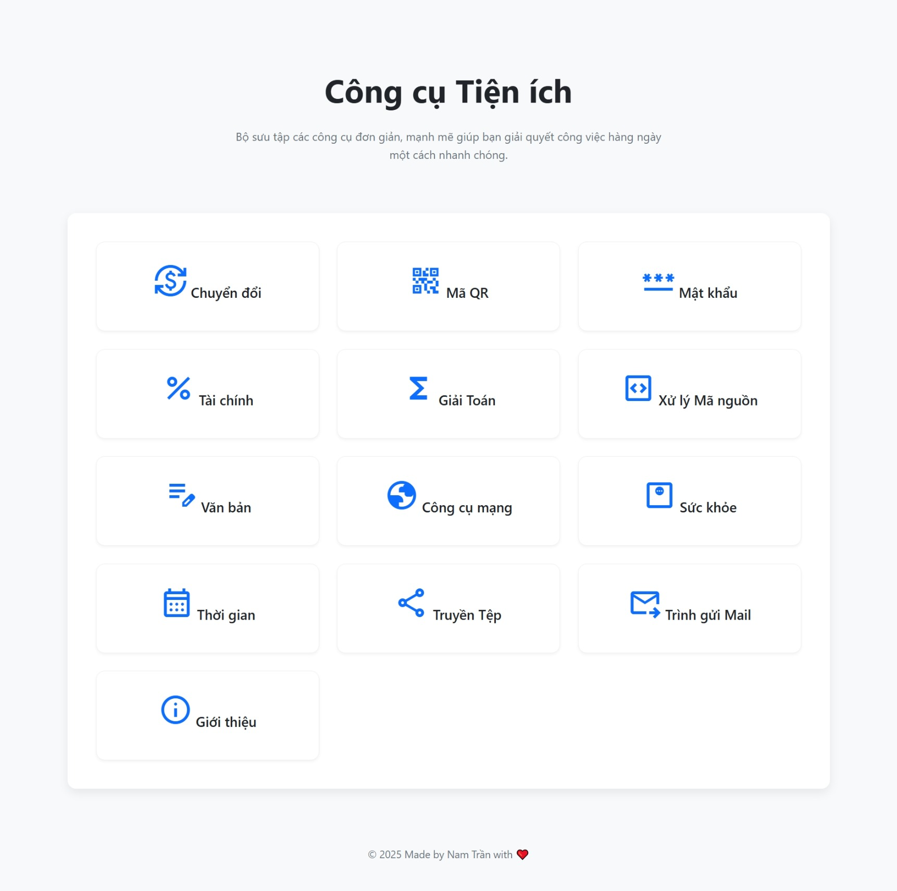

# Trang Công cụ Tiện ích | All-in-One Utility Tools Website

[](https://opensource.org/licenses/MIT)
[](https://github.com/Namtran592005/ultility)
[](https://web.dev/progressive-web-apps/)
[](./ephemeral-core.js)

Một bộ công cụ tiện ích đa năng, hiện đại và cực kỳ nhanh, được xây dựng với triết lý **"Quyền riêng tư tuyệt đối"**. Mọi tác vụ đều được xử lý 100% phía client, không quảng cáo, không theo dõi, không lưu trữ bất kỳ dữ liệu nào.

---

### 🚀 **[Xem Demo Trực Tiếp](https://tranvohoangnam.id.vn/utility/)**



---

### 💡 Triết lý Thiết kế

Dự án này được xây dựng dựa trên bốn nguyên tắc cốt lõi:

*   🔒 **Quyền riêng tư Tuyệt đối:** Không có dữ liệu nào của bạn được gửi đến máy chủ. Mọi tính toán và xử lý đều diễn ra an toàn ngay trên trình duyệt của bạn.
*   ⚡ **Hiệu suất Tối đa:** Được xây dựng bằng Vanilla JavaScript (không framework), không mã theo dõi. Chỉ có công cụ bạn cần, hoạt động nhanh như chớp.
*   ✨ **Thiết kế Tối giản:** Giao diện người dùng sạch sẽ, trực quan và có chế độ Dark Mode, giúp bạn tập trung vào công việc mà không bị phân tâm.
*   📖 **Mã nguồn Mở:** Toàn bộ dự án là mã nguồn mở. Bạn có thể tự do kiểm tra, đóng góp và tin tưởng vào cách chúng tôi xây dựng sản phẩm.

---

### 🛠️ Các Trung tâm Tiện ích Nổi bật

Dự án được tổ chức thành các "Trung tâm" (Hubs), mỗi trung tâm chứa một bộ công cụ liên quan:

*   **(🖥️) Trung tâm Xử lý Mã nguồn:**
    *   Định dạng & Rút gọn (Formatter/Minifier) cho JSON, CSS, JS, HTML, SQL.
    *   Mã hóa & Giải mã (Encoder/Decoder) cho Base64, URL.
    *   Trình xem JSON dạng cây tương tác.

*   **(🧠) Trung tâm Giải toán Nâng cao:**
    *   Giải các bài toán từ Số học, Đại số, Hình học, Giải tích, Ma trận đến Thống kê.
    *   Hiển thị các bước giải thích (khi có thể).

*   **(🌐) Trung tâm Tiện ích Mạng:**
    *   Phân tích Subnet (Subnet Calculator) chi tiết.
    *   Tra cứu IP Geolocation, tra cứu DNS.
    *   Công cụ "What's My IP?".

*   **(💰) Trung tâm Tài chính:**
    *   Tính lãi kép, lập kế hoạch tiết kiệm, tính toán khoản vay.
    *   Biểu đồ trực quan hóa kết quả.

*   **(⏰) Trung tâm Thời gian:**
    *   Tính khoảng thời gian, cộng/trừ ngày, tính tuổi (với cung hoàng đạo/con giáp), đếm ngược sự kiện.

*   ... và nhiều công cụ khác như **Phân tích Sức khỏe**, **Quản lý Mật khẩu**, **Tạo mã QR**, **Chuyển đổi Đa năng**.

---

### 🔬 Kiến trúc Độc đáo: Lõi Trạng thái Tạm thời (`ephemeral-core.js`)

Điểm khác biệt lớn nhất của dự án này nằm ở kiến trúc "không lưu trữ" được thực thi bởi một lõi JavaScript độc đáo có tên `ephemeral-core.js`.

**Cơ chế hoạt động:**
1.  **Không tệp vật lý:** Tệp này chứa mã nguồn của cả **Service Worker** và **Manifest** dưới dạng chuỗi JavaScript.
2.  **Tự kiến tạo từ bộ nhớ:** Khi được tải, nó sử dụng `Blob` và `URL.createObjectURL` để tạo ra các phiên bản "ảo" của `sw.js` và `manifest.json` ngay trong bộ nhớ của trình duyệt.
3.  **Tự động đăng ký & tiêm:** Script sẽ tự động đăng ký Service Worker "ảo" và tiêm thẻ `<link rel="manifest">` vào `<head>` của trang.

**Kết quả:**
*   **Zero Footprint:** Không cần các tệp `sw.js` hay `manifest.json` vật lý trong dự án.
*   **Bảo mật Tối đa:** Service Worker được thiết kế không phải để cache, mà để **dọn dẹp**. Nó chủ động xóa sạch TOÀN BỘ cache của trang web mỗi khi được kích hoạt, đảm bảo mỗi lần truy cập đều là một phiên hoàn toàn mới, sạch sẽ.
*   **Triển khai Tối giản:** Chỉ cần nhúng một tệp `ephemeral-core.js` duy nhất vào tất cả các trang HTML.

---

### 💻 Công nghệ Sử dụng

*   **Ngôn ngữ:** HTML5, CSS3, JavaScript (ES6+)
*   **Thư viện chính:**
    *   **CodeMirror:** Trình soạn thảo mã nguồn mạnh mẽ.
    *   **Chart.js:** Trực quan hóa dữ liệu và biểu đồ.
    *   **Math.js:** Thư viện tính toán toán học nâng cao.
*   **Kiến trúc:** Vanilla JS, không sử dụng framework, PWA (Progressive Web App) Capable.

---

### 🙌 Đóng góp

Mọi sự đóng góp đều được chào đón! Nếu bạn có ý tưởng về một tính năng mới, phát hiện lỗi, hoặc muốn cải thiện mã nguồn

---

### 📜 Giấy phép

Dự án này được cấp phép dưới **Giấy phép MIT**. Xem chi tiết tại tệp `LICENSE`.```
